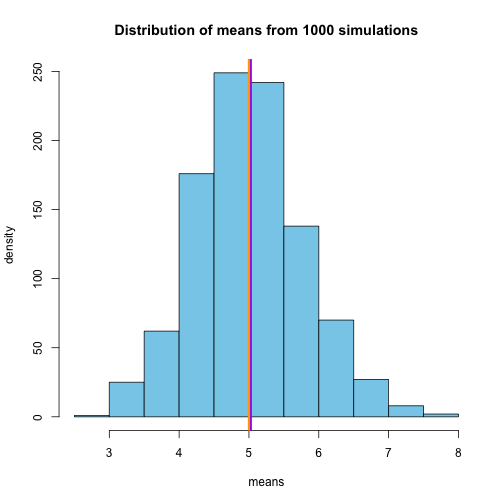
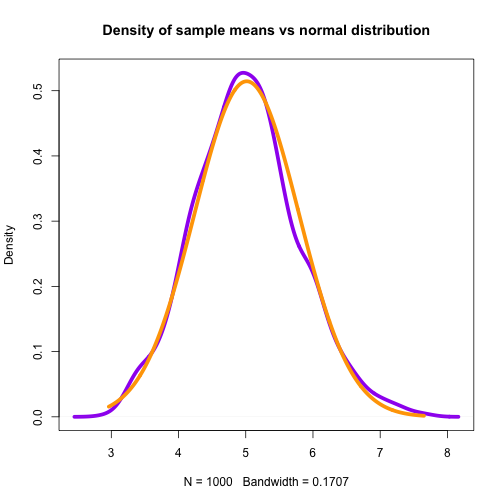

Exponential Distribution Simulation Analysis
============================================

## Synopsis

The exponential distribution can be simulated in R with rexp(n, lambda) where lambda is the rate parameter. The mean of exponential distribution is 1/lambda and the standard deviation is also 1/lambda. Set lambda = 0.2 for all of the simulations. In this simulation, we will investigate the distribution of averages of 40 exponential(0.2)s. For this we will need to do a thousand simulated averages of 40 exponentials. After analyzing the simulation results, it is shown that this averages are approximately normal and also that the distributions are centered at the population mean.


## Data Processing

Load the required packages. Define the variables.


```r
lambda <- 0.2
n <- 40
sim <- 1000
```

Compute the theoritical mean, standard deviation and variance.

```r
tMean <- 1/lambda
tStd <- 1/lambda * 1/sqrt(n)
tVariance <- tStd^2
```

## Analysis

In the next activity, we will repeatedly sample from the exponential distribution. Each sample will select 40 random numbers from the exponential distribution having rate 0.2. We will then find the mean of the 40 numbers in our sample repeating this for 1000 times.


```r
xbar <- NULL
for (i in 1:1000) { 
    xbar[i] <- mean(rexp(n,rate = lambda)) 
    }
```

Compute the mean, standard deviation and variance from the averages of 1000 simulations.

```r
sMean <- mean(xbar)
sStd <- sd(xbar)
sVariance <- var(xbar)
```

## Results

1.Show where the distribution is centered at and compare it to the theoretical center of the distribution.

```r
#distribution mean
sMean
```

```
## [1] 5.014766
```


```r
#theoretical mean
tMean
```

```
## [1] 5
```

Histogram plot of distribution of sample means of 1000 simulations.


```r
hist(xbar,breaks=10,col="skyblue",
     main="Distribution of means from 1000 simulations",ylab="density", xlab="means")
abline(v = sMean,col = "purple",lwd = 5)
abline(v = tMean, col = "orange", lwd = 3)
```

 

As seen from the plot above, the distribution mean(purple) and the theoretical mean(orange) values are very close.

2.Show how variable it is and compare it to the theoretical variance of the distribution.


```r
sVariance
```

```
## [1] 0.6014566
```


```r
tVariance
```

```
## [1] 0.625
```

The variance of the distribution is `sVariance` and the theoretical variance of the distribution is `tVariance`. The variability in distribution of averages of 40 exponentials is close to the theoretical variance of the distribution. It can be expected that as we increase the number of simulations, we will get closer to the theoretical values.

3.Show that the distribution is approximately normal.

Draw a histogram plot of the focus on the difference between the distribution of a large collection of random exponentials and the distribution of a large collection of averages of 40 exponentials. 

Histogram plot of distribution of large collection of random exponentials.


```r
plot(density(xbar), col = "purple", lwd = 5, main = "Density of sample means vs normal distribution")
x = seq(min(xbar),max(xbar),length=1000) 
y = dnorm(x,mean=sMean,sd = sStd) 
lines(x,y,col="orange", lwd = 5) 
```

 

From the plot above, it can be seen that sample means density distribution is very close to the normal density distribution and it can be deduced that the sample means distribution is approximately normal. It's clear from this analysis that as stated by Central Limit Theorem, that averages are approximately normal with distributions centered at the population mean. 

