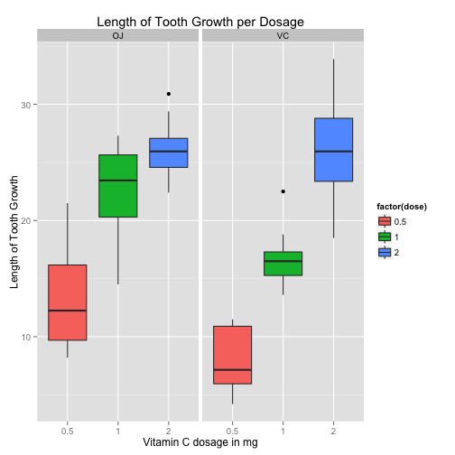

Exponential Distribution Simulation
===================================

## Synopsis

For the ToothGrowth data in the datasets, we perform basic exploratory analyses and provide basic summary. By using confidence intervals and hypothesis tests, we compare tooth growth by supp and dose variables.

## Data Processing

Load the required packages and the data ToothGrowth. 

```r
library(ggplot2)

library(datasets)
data(ToothGrowth)
```

The dataset ToothGrowth lists the effect of Vitamin C given via two delivery methods, orange juice or ascorbic acid(OJ and VC) on Tooth Growth in Guinea Pigs.

## Analysis

* Summary

Check the summary and dimensions.

```r
dim(ToothGrowth)
```

```
## [1] 60  3
```

```r
summary(ToothGrowth)
```

```
##       len        supp         dose      
##  Min.   : 4.20   OJ:30   Min.   :0.500  
##  1st Qu.:13.07   VC:30   1st Qu.:0.500  
##  Median :19.25           Median :1.000  
##  Mean   :18.81           Mean   :1.167  
##  3rd Qu.:25.27           3rd Qu.:2.000  
##  Max.   :33.90           Max.   :2.000
```

For initial analysis of the data, we draw the box plot of the data with various levels of dosage.


```r
g <- ggplot(ToothGrowth, aes( x = factor(dose), y = len, fill = factor(dose)))
g <- g + geom_boxplot() + facet_grid(.~supp) +
    labs(x="Vitamin C dosage in mg", y="Length of Tooth Growth", title="Length of Tooth Growth per Dosage") 
print(g)
```

 

From the summary, it shows that there are three levels of amount dosage and two types of Vitamin C supplement. From the box plot above it is analysed that higher amounts of dose either Orange Juice or Ascorbic acid results in longer tooth growth.

* T Confidence intervals and hypothesis tests

Check for group differences due to different supplement type.

```r
# Assume unequal variances between the two groups
t.test(len ~ supp, data = ToothGrowth)
```

```
## 
## 	Welch Two Sample t-test
## 
## data:  len by supp
## t = 1.9153, df = 55.309, p-value = 0.06063
## alternative hypothesis: true difference in means is not equal to 0
## 95 percent confidence interval:
##  -0.1710156  7.5710156
## sample estimates:
## mean in group OJ mean in group VC 
##         20.66333         16.96333
```

The p-value is 0.06 and contains zero confidence interval and hence the null hypothesis can not be rejected.

Create three groups of data, each containing two levels of dose pairs.

```r
pair1<-subset(ToothGrowth, dose %in% c(0.5, 1.0))
pair2<-subset(ToothGrowth, dose %in% c(1.0, 2.0))
pair3<-subset(ToothGrowth, dose %in% c(2.0, 0.5))
```

Perform the t-test on pair 1, with two different dose levels to check group differences due to different dose levels(0.5, 1.0)

```r
t.test(len ~ dose, data = pair1)
```

```
## 
## 	Welch Two Sample t-test
## 
## data:  len by dose
## t = -6.4766, df = 37.986, p-value = 1.268e-07
## alternative hypothesis: true difference in means is not equal to 0
## 95 percent confidence interval:
##  -11.983781  -6.276219
## sample estimates:
## mean in group 0.5   mean in group 1 
##            10.605            19.735
```

Perform the t-test on pair 2, with two different dose levels to check group differences due to different dose levels(1.0, 2.0)

```r
t.test(len ~ dose, data = pair2)
```

```
## 
## 	Welch Two Sample t-test
## 
## data:  len by dose
## t = -4.9005, df = 37.101, p-value = 1.906e-05
## alternative hypothesis: true difference in means is not equal to 0
## 95 percent confidence interval:
##  -8.996481 -3.733519
## sample estimates:
## mean in group 1 mean in group 2 
##          19.735          26.100
```

Perform the t-test on pair 3, with two different dose levels to check group differences due to different dose levels(2.0, 0.5)

```r
t.test(len ~ supp, data = pair3)
```

```
## 
## 	Welch Two Sample t-test
## 
## data:  len by supp
## t = 0.9216, df = 35.105, p-value = 0.363
## alternative hypothesis: true difference in means is not equal to 0
## 95 percent confidence interval:
##  -3.10849  8.27849
## sample estimates:
## mean in group OJ mean in group VC 
##           19.645           17.060
```

## Results

For all three dose level pairs, the p-value is less than 0.05 and the confidence interval does not contain zero and hence the null hypothesis of no affect of dose on the tooth growth can be rejected. Further from the box plot we can see that increasing the dosage increases the tooth length.

* Conclusions
1. As the dose level is increased, the growth of the tooth length increases.

* Assumptions
1. For t-tests, the variances are assumed to be unequal for the two groups being compared.
2. The sample population 60 guinea pigs are representative of the entire population of guinea pigs.

